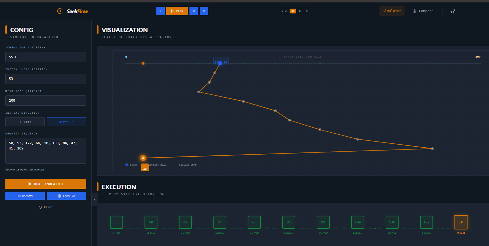
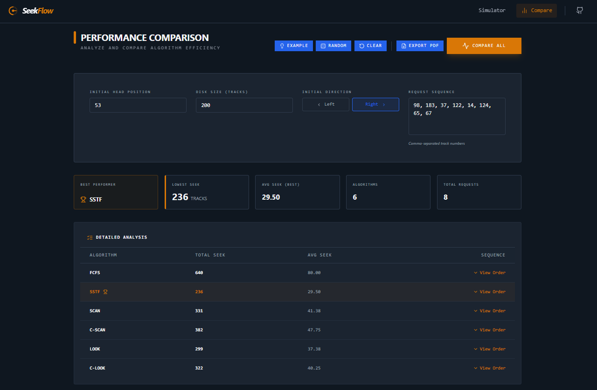

# 🛰️ SeekFlow - Mission Control for Disk Scheduling

[](https://react.dev/)
[](https://www.typescriptlang.org/)
[](https://vitejs.dev/)
[](https://tailwindcss.com/)
[](https://opensource.org/licenses/MIT)

**SeekFlow** is a premium-quality web application designed to visualize and analyze Operating System Disk Scheduling Algorithms. Built with a professional "Mission Control" industrial aesthetic, it provides an engineering-focused dashboard for real-time simulation and performance benchmarking.

## 🖼️ Preview

### 🖥️ Real-Time Simulator


### 📊 Performance Comparison


---

## ❓ Why SeekFlow?

Disk scheduling is a fundamental concept in Operating Systems, yet it is often taught through abstract diagrams. SeekFlow bridges the gap between theory and intuition by providing a high-fidelity environment where users can:
- **Visualize Spatial Traversal:** See exactly how the disk head moves across tracks over time.
- **Analyze Efficiency:** Quantify seek distances and understand the performance trade-offs of different scheduling strategies.
- **Debug Logic:** Follow step-by-step mathematical calculations for every head movement.

## ✨ Key Features

- **🚀 Live Simulation Engine:** Real-time playback with variable speed controls (0.5x to 4x), step-by-step navigation, and interactive pause/resume.
- **📈 Advanced Visualization:** Chronological "Time vs. Track" traversal graph that prevents line overlapping and provides clear path visibility.
- **🧬 Multiple Algorithms:** Support for six industry-standard algorithms:
  - FCFS (First-Come, First-Served)
  - SSTF (Shortest Seek Time First)
  - SCAN (Elevator Algorithm)
  - C-SCAN (Circular SCAN)
  - LOOK
  - C-LOOK
- **⚖️ Comparative Analysis:** Benchmarking module to compare all algorithms simultaneously with "Best Performer" detection and detailed efficiency reports.
- **📋 Educational Insights:** Collapsible step-by-step seek distance calculations to understand the mathematical logic behind each movement.
- **📄 Professional Reporting:** Export full simulation results and performance comparisons to high-quality PDF reports.

## 🧮 Supported Algorithms

| Algorithm | Description | Best Case |
| :--- | :--- | :--- |
| **FCFS** | Processes requests in the order they arrive. | Fairness |
| **SSTF** | Selects the request with the minimum seek time from the current head position. | Minimum Seek |
| **SCAN** | Head moves in one direction to the end, then reverses (Elevator). | Throughput |
| **C-SCAN** | Circular SCAN; moves to the end then jumps back to the start. | Uniform Wait Time |
| **LOOK** | Similar to SCAN but only goes as far as the last request. | Efficiency |
| **C-LOOK** | Circular LOOK; moves to the last request then jumps to the first. | Optimized Uniform Wait |

## 🛠️ Tech Stack

- **Framework:** React 19 (Functional Components, Hooks)
- **Language:** TypeScript (Strict Mode)
- **Build Tool:** Vite
- **Styling:** Tailwind CSS 4 (Custom industrial color palette)
- **Animations:** Framer Motion (Subtle UI transitions)
- **Icons:** Lucide React
- **PDF Export:** jsPDF + autoTable

## 📖 Usage

### Running a Simulation
1. Select an **Algorithm** from the configuration sidebar.
2. Set the **Initial Head Position** and **Disk Size**.
3. Choose the **Initial Direction** (for SCAN-based algorithms).
4. Enter a **Request Sequence** as comma-separated integers.
5. Click **Run Simulation** to load the data.
6. Use the **Playback Controls** in the navbar to start, pause, or step through the movement.

### Comparing Algorithms
1. Navigate to the **Compare** tab via the navbar.
2. Enter your parameters and click **Compare All**.
3. Analyze the **Detailed Analysis** table to see which algorithm performed best for your specific workload.
4. Click **Export PDF** to download a comprehensive report.

## 🚀 Getting Started

### Prerequisites
- [Node.js](https://nodejs.org/) (Latest LTS)
- npm or yarn

### Installation

1. **Clone the repository:**
   ```bash
   git clone https://github.com/your-repo/seekflow.git
   cd seekflow
   ```

2. **Install dependencies:**
   ```bash
   npm install
   ```

3. **Start the development server:**
   ```bash
   npm run dev
   ```

---

Built with ❤️ for Engineering Students and OS Enthusiasts.
